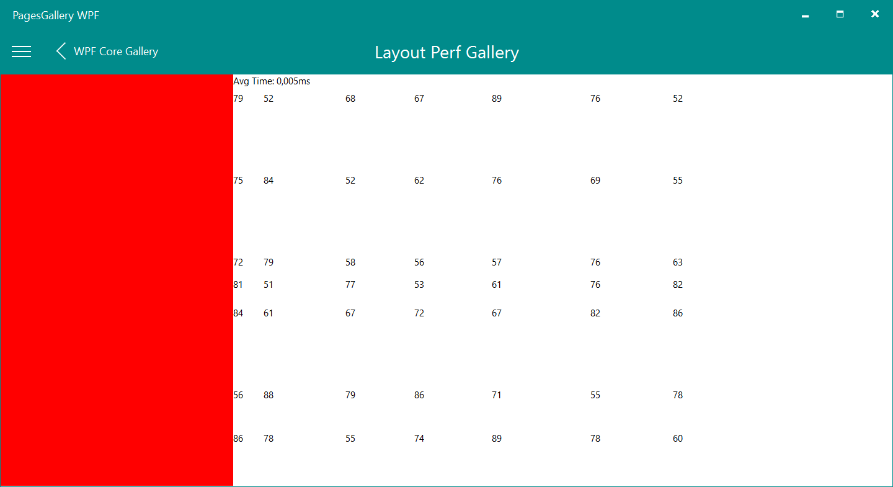
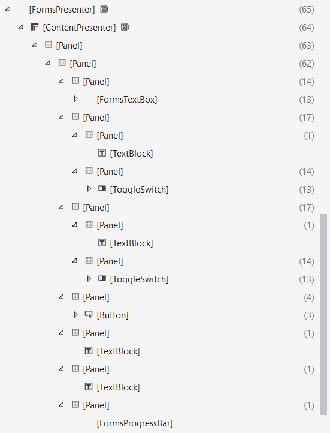
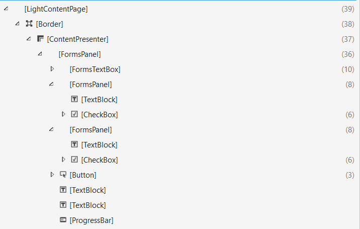

# Xamarin.Forms WPF Backend

The purpose of this repository is to show the status of the **WPF backend of Xamarin.Forms**. 

Windows Presentation Foundation (WPF) is the presentation (user-interfaces) sub system of .NET framework. It is used to create user interfaces for Windows operating system. The user interfaces are also known as Windows client applications or Windows applications. 

Xamarin.Forms WPF Backend | 
------ | 
[Xamarin.Forms.Platform.WPF](https://github.com/mohachouch/Xamarin.Forms/tree/wpf-newimpl) |

Xamarin.Forms WPF Backend Samples | 
------ | 
[Movies](https://github.com/mohachouch/xamarin-forms-gtk-movies-sample/tree/wpf) |
[Hanselman.Forms](https://github.com/mohachouch/Hanselman.Forms/tree/wpf) |
[WeatherApp](https://github.com/mohachouch/MyWeather.Forms/tree/wpf) |

## Xamarin.Forms

Xamarin.Forms provides a way to quickly build native apps for iOS, Android, Windows, macOS and Linux, completely in C#.

Read more about the platform at [https://www.xamarin.com/forms](https://www.xamarin.com/forms).

## Status

Curently, the WPF Backend allows to develop applications, but it is still in development. If you want to know in detail the **status**, navigate to the [Status section](Status.md).

## How can I try?

This is really simple. You can test the latest Xamarin Forms WPF on Nightly build.  

This project requires two libraries:
- Xamarin.Forms.Platform.WPF: Xamarin Forms WPF Backend
- WpfLightToolkit: It's a collection of helper functions and custom controls for Xamarin.Forms WPF Backend.

To test this project you must add this two Nuget sources in Visual Studio:
- Xamarin.Forms WPF CI: https://ci.appveyor.com/nuget/xamarin-forms-wpf-ci
- WpfLightToolkit CI: https://ci.appveyor.com/nuget/wpflighttoolkit-ci

## Performance

Quality is top of the list of priorities. This means stability and performance first and foremost. Constant testing on a huge volume of samples to achieve this goal.

### Fast Renderer

All renderer are fast ! The controls are not embedded into a panel.

Bellow the difference between WPF and UWP.

<table style="width:100%">
  <tr>
    <th>UWP</th>
    <th>WPF</th>
  </tr>
  <tr>
    <td></td>
    <td></td>
  </tr>
</table>

